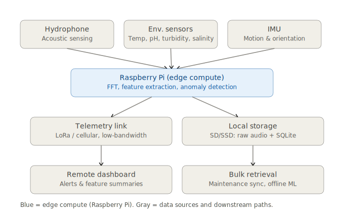

# System Architecture

Status: planning/architecture phase. No hardware purchased, no implementation code written yet. This document describes the intended system, consistent with [DECISIONS.md](../DECISIONS.md).



## Overview

The system is a single-node acoustic + environmental monitoring platform built around a Raspberry Pi as the edge compute unit. It performs on-device signal processing and anomaly detection, and transmits only compact summaries over a low-bandwidth link, while retaining full-resolution data locally for manual retrieval. The core architecture is deployment-agnostic: the same electronics and software stack run whether the unit is mounted on a floating buoy or a fixed dock/pier structure. Multi-node/multi-buoy scaling and a central time-series backend are explicitly future work, not part of this design.

## Component-level data flow

```
[Hydrophone / acoustic sensor]
[Environmental sensors: temp, depth/pressure, etc.]
        |
        v
[ADC / sensor interface] ---------------------------+
        |                                           |
        v                                           v
[Raspberry Pi - Edge Compute]                [System health sensors]
   |                                          (battery, solar charge,
   |  1. Capture window (N sec, duty cycle)    enclosure temp, uptime)
   |  2. FFT + feature extraction                    |
   |     (Librosa/SciPy: MFCCs, spectral            |
   |     centroid, ZCR, RMS energy,                 |
   |     spectral flatness)                          |
   |  3. Concatenate with normalized                 |
   |     environmental features + rate-of-change     |
   |  4. Unsupervised anomaly detection              |
   |     (Isolation Forest / autoencoder             |
   |     reconstruction error vs. calibration        |
   |     baseline)                                   |
   |  5. Sleep until next wake window                |
   |                                                  |
   v                                                  v
[Local Storage: SD/SSD]                    [SQLite (WAL mode) on Pi]
 - Raw audio, flat WAV/FLAC files           - Feature vectors
 - Filename indexed by timestamp            - Environmental readings
 - Full resolution, retained locally        - Telemetry/system health log
                                             - Anomaly flags
                                             - Rows reference audio filenames
                                               (no embedded audio)
        |                                           |
        | (bulk, in-person)                         | (compact payload,
        |                                           |  on duty cycle)
        v                                           v
[Maintenance visit /                       [Low-bandwidth link:
 opportunistic high-bandwidth sync]         LoRa or low-bandwidth cellular]
        |                                           |
        v                                           v
[Offline / bulk analysis]                  [Remote receiver / base station]
 - Batch ML analysis                         - Feature summaries
 - Supervised classification (future,        - Environmental readings
   trained offline, lightweight              - Anomaly alerts
   inference artifact deployed to Pi)
 - Calibration baseline updates
```

## Edge / cloud (offsite) compute split

**Edge (Pi, always-on, per wake window):**
- Sensor capture (acoustic + environmental) on a scheduled duty cycle: record N seconds every M minutes. Triggered wake-on-threshold sampling is a documented future enhancement, not built now.
- FFT and feature extraction (Librosa/SciPy).
- Joint acoustic + environmental feature vector construction.
- Unsupervised anomaly detection against a locally-held calibration baseline.
- Local persistence: raw audio to flat files, structured data to SQLite.
- Compact payload transmission over the low-bandwidth link.

Cadence: near-real-time within each wake window — capture, process, sleep. No heavy/batch computation happens on the Pi during normal operation.

**Offsite (manual retrieval / future backend), not real-time:**
- Bulk retrieval of full-resolution raw audio and sensor logs, either at maintenance visits or via opportunistic high-bandwidth sync.
- Heavier/batch analysis, including any ML beyond the on-device anomaly detector.
- Supervised classification (random forest or small NN): explicit future work, gated on accumulating labeled/reviewed anomalies or transfer learning from public bioacoustic datasets. Training happens offline; only a lightweight inference artifact is deployed back to the Pi.
- Future: central time-series DB (TimescaleDB/InfluxDB) as a multi-buoy scaling path. Not built now.

There is no real-time cloud dependency. The low-bandwidth link only ever carries small, pre-computed payloads (feature summaries, environmental readings, anomaly alerts) — never raw audio.

## Deployment profiles on the same core architecture

The electronics, sensor set, edge processing pipeline, storage layout, and telemetry link are identical across profiles. Only the physical mounting and power/environmental exposure differ.

**Buoy (primary reference platform):**
- Moored or floating platform.
- Power: solar panel + battery, sized for duty-cycle operation between charge cycles.
- Additional environmental exposure: wave motion, biofouling, mooring/drift considerations — addressed at the mechanical/enclosure level, not the software/architecture level.
- Maintenance access requires a boat trip; favors the low-bandwidth link + periodic bulk retrieval model.

**Fixed dock/pier mount (documented lower-effort alternative):**
- Same electronics, same software stack, same Pi + sensor + storage + telemetry configuration.
- Power may optionally come from shore power instead of solar+battery, but solar+battery remains a valid option here too — the architecture does not assume either power source.
- Easier physical access for maintenance and bulk data retrieval; may reduce reliance on the low-bandwidth link in practice, but the link and duty-cycle model are unchanged.

Because both profiles share the same core (edge compute, tiered telemetry, local storage schema, ML pipeline), a diagram or implementation change to the core applies to both without profile-specific branching. Profile-specific detail (mounting hardware, power system sizing, enclosure rating) belongs in [hardware-spec.md](hardware-spec.md), not here.
