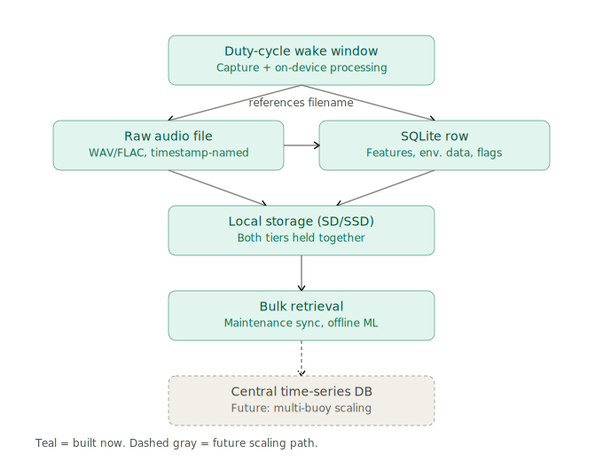

# Data Pipeline

Status: planning/architecture phase. No implementation code yet. Consistent with [DECISIONS.md](../DECISIONS.md) and [architecture.md](architecture.md).

## Storage tiers



**Tier 1 — Raw audio, flat files (local storage, SD/SSD)**
Full-resolution WAV/FLAC files, one per capture window. Filename encodes capture timestamp, giving a natural sort order and avoiding a filename-lookup table. This is the largest and highest-fidelity data tier; never transmitted over the low-bandwidth telemetry link, only retrieved in bulk.

**Tier 2 — Structured data, SQLite (WAL mode, local on Pi)**
Feature vectors, environmental readings, telemetry/system health log, anomaly flags. Rows reference the Tier 1 filename rather than embedding audio, keeping the database small and fast regardless of how much raw audio accumulates. WAL mode allows the capture/processing loop to write concurrently with any read access (e.g. a maintenance-visit export) without blocking.

**Tier 3 — Central time-series DB (TimescaleDB/InfluxDB) — future, not built now**
Noted as the multi-buoy scaling path: once more than one unit is deployed, structured data (not raw audio) would sync from each Pi's SQLite instance into a central store for cross-site querying. Out of scope for the current single-node design; SQLite schema below is designed so its rows could later be ingested into such a store without restructuring.

## Duty-cycle sampling and near-real-time on-device flow

Baseline operation is scheduled duty-cycle sampling: record N seconds every M minutes. Triggered wake-on-threshold sampling is documented future work, not built now.

Per wake window:

1. Wake, capture N seconds of hydrophone audio + environmental readings + IMU/system-health readings.
2. Write raw audio to a flat file (Tier 1), named by capture timestamp.
3. Run FFT + feature extraction on the captured audio (Librosa/SciPy: MFCCs, spectral centroid, ZCR, RMS energy, spectral flatness).
4. Normalize environmental readings (including rate-of-change against the prior window) and concatenate with the acoustic features into one joint feature vector.
5. Run unsupervised anomaly detection (Isolation Forest / autoencoder reconstruction error) against the stored calibration baseline.
6. Write feature vector, environmental reading, and anomaly flag rows to SQLite (Tier 2), each referencing the Tier 1 filename.
7. Assemble a compact telemetry payload (feature summary + environmental readings + anomaly alert if flagged) and transmit over the low-bandwidth link.
8. Sleep until the next wake window.

This entire sequence is near-real-time within the wake window — capture, process, sleep. No heavier/batch analysis (including any ML beyond step 5) runs on the Pi during normal operation; that happens offline during bulk retrieval.

## Bulk retrieval / sync process (raw audio)

Full-resolution raw audio and sensor logs are not transmitted over telemetry. They're retrieved either:

- **At a maintenance visit**: physical access to the unit, direct copy of Tier 1 files (and optionally the SQLite file) off local storage.
- **Opportunistic high-bandwidth sync**: if the deployment site occasionally has a high-bandwidth link available (e.g. dock profile near WiFi), a bulk sync job transfers accumulated Tier 1 files without waiting for a physical visit.

Retrieved data feeds offline/batch analysis: recalibration of the anomaly baseline, any heavier ML work, and (future) supervised classification training. Tier 2 SQLite rows already reference Tier 1 filenames, so retrieved audio and existing structured data join without extra bookkeeping.

## SQLite schema sketch

All tables live in one SQLite database file on the Pi, WAL mode enabled. This is a rough sketch of shape, not a final DDL.

```sql
-- One row per capture window; anchors the other tables via capture_id
CREATE TABLE captures (
    capture_id     INTEGER PRIMARY KEY,
    timestamp_utc  TEXT NOT NULL,          -- ISO 8601
    audio_filename TEXT NOT NULL,          -- Tier 1 flat file reference
    duration_sec   REAL NOT NULL,
    sample_rate_hz INTEGER NOT NULL
);

-- Acoustic + environmental feature vector per capture window
CREATE TABLE feature_vectors (
    capture_id            INTEGER PRIMARY KEY REFERENCES captures(capture_id),
    mfcc                  BLOB,            -- serialized MFCC coefficient array
    spectral_centroid     REAL,
    zero_crossing_rate    REAL,
    rms_energy            REAL,
    spectral_flatness     REAL,
    feature_vector_version TEXT            -- tracks feature-extraction code version
);

-- Environmental sensor readings per capture window
CREATE TABLE environmental_readings (
    capture_id       INTEGER PRIMARY KEY REFERENCES captures(capture_id),
    temperature_c    REAL,
    ph               REAL,
    turbidity_ntu    REAL,
    salinity_psu     REAL,
    temp_roc         REAL,   -- rate-of-change vs. prior window
    ph_roc           REAL,
    turbidity_roc    REAL,
    salinity_roc     REAL
);

-- Anomaly detection results per capture window
CREATE TABLE anomaly_flags (
    capture_id        INTEGER PRIMARY KEY REFERENCES captures(capture_id),
    anomaly_score     REAL NOT NULL,      -- reconstruction error / isolation score
    is_anomaly        INTEGER NOT NULL,   -- boolean, 0/1
    baseline_version  TEXT                -- which calibration baseline was active
);

-- Telemetry/system health log, independent cadence from captures
CREATE TABLE system_health_log (
    log_id           INTEGER PRIMARY KEY,
    timestamp_utc    TEXT NOT NULL,
    battery_voltage  REAL,
    solar_charge_w   REAL,
    enclosure_temp_c REAL,
    imu_orientation  BLOB,               -- serialized orientation reading
    uptime_sec       INTEGER
);
```

`captures` is the join key across `feature_vectors`, `environmental_readings`, and `anomaly_flags` — each of those is a strict one-to-one extension of a capture row, split out for clarity rather than one wide table. `system_health_log` is intentionally decoupled from `captures` since health telemetry may be logged on a different cadence than acoustic sampling.
