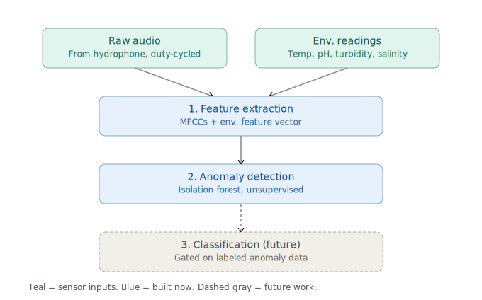

# ML Pipeline

Status: planning/architecture phase. No implementation code yet. Consistent with [DECISIONS.md](../DECISIONS.md). Three stages, per the locked decision — this document expands each into implementation-blueprint detail.

## Stage 0 — Signal conditioning

Runs on the Pi, immediately after capture and immediately before Stage 1 feature extraction, in the same wake window (see [data-pipeline.md](data-pipeline.md)). Purely a pre-processing pass on the raw audio — it produces no features and nothing is persisted from it beyond a diagnostic SNR estimate; its only output is conditioned audio handed to Stage 1.

**Bandpass filter (Butterworth, via SciPy):**
- Isolates the frequency range that carries signal of interest and discards the rest before it can add noise/variance to downstream features.
- Vessel tonal peaks (shaft/blade-rate harmonics) concentrate around 60–120 Hz; biological calls typically extend higher. Default passband: 20–4000 Hz — wide enough to retain both, while cutting very low-frequency flow/handling noise below 20 Hz and very high-frequency electronic/self-noise above 4 kHz.
- Zero-phase (filtfilt-style) application, so no time delay is introduced ahead of Stage 1's time-domain features (RMS std, ZCR).

**Noise floor estimation:**
- Estimated from the quietest ~1-second segment of the capture window, standing in for a noise-only reference since there's no separate noise-only channel to sample.
- Produces a per-frequency-bin magnitude spectrum (via STFT), used as the subtrahend in spectral denoising below.

**Spectral denoising (spectral subtraction):**
- STFT the (bandpass-filtered) signal, subtract the estimated noise floor's magnitude per frame, reconstruct via inverse STFT using the original phase.
- Baseline method, not state-of-the-art: known to produce "musical noise" (isolated, randomly-appearing tonal artifacts) from hard-flooring negative post-subtraction magnitude at zero. Acceptable for this stage; a more robust approach (Wiener filtering, oversubtraction with a spectral floor, minimum-statistics noise tracking) is a candidate future improvement if conditioning quality turns out to bottleneck downstream detection.

**Output:** conditioned audio (same shape as the raw capture) passed directly into Stage 1, plus a diagnostic dict of estimated SNR before/after conditioning (in dB) for sanity-checking that conditioning is actually helping on a given window. Tier 1 storage still archives the *raw*, unconditioned audio — conditioning is a feature-extraction-time step, not a change to what's archived.

## Stage 1 — On-device feature extraction

Runs on the Pi, every wake window, as part of the near-real-time capture -> process -> sleep loop (see [data-pipeline.md](data-pipeline.md)).

**Acoustic features (via Librosa/SciPy), computed per capture window:**
- MFCCs (Mel-frequency cepstral coefficients) — compact representation of spectral envelope/timbre, standard for bioacoustic and general audio classification.
- Spectral centroid — "brightness"/center of mass of the spectrum, sensitive to shifts in dominant frequency content.
- Zero-crossing rate (ZCR) — proxy for noisiness/percussiveness of the signal, cheap to compute.
- RMS energy — overall signal loudness/intensity for the window.
- Spectral flatness — tonal vs. noise-like character of the spectrum (near 1.0 = noise-like, near 0 = tonal).

**Environmental features:**
- Normalized temperature, pH, turbidity, salinity readings.
- Rate-of-change (roc) for each, computed against the prior window — captures trend/rapid-shift signal that a raw instantaneous reading misses.

**Output:** one joint acoustic+environmental feature vector per capture window, concatenating both feature groups into a single vector. This joint vector is the sole input to Stage 2, and is what gets persisted to the `feature_vectors` / `environmental_readings` SQLite tables ([data-pipeline.md](data-pipeline.md)).

Implementation note: feature extraction code version should be tracked (see `feature_vector_version` column) since any change to the feature set or extraction parameters invalidates comparability with previously-computed vectors and any baseline trained on them.

## Stage 2 — Unsupervised anomaly detection

Runs on-device, immediately after Stage 1, against a **learned baseline from an initial calibration period**.

**Candidate algorithms:**
- Isolation Forest — tree-based, isolates outliers via random partitioning; cheap to train and run, no assumption of feature distribution shape, well suited to a Pi's compute budget.
- Autoencoder reconstruction error — small neural net trained to reconstruct "normal" feature vectors; anomaly score is reconstruction error at inference. Higher compute cost than Isolation Forest but can capture nonlinear structure in the joint feature space.

Choice between the two (or running both and comparing) is an implementation-time decision, not fixed here; both are viable candidates per DECISIONS.md.

**Why unsupervised is viable from day one:**
- No labeled anomaly data exists yet (no hardware deployed, no field data collected) — a supervised model has nothing to train on at this stage.
- The calibration period establishes what "normal" looks like at the specific deployment site directly from unlabeled data, which is exactly what these algorithms need.
- Marine bioacoustic/environmental anomalies (equipment fault, unusual biological event, pollution event, etc.) are rare and diverse by nature — an unsupervised approach detects "doesn't look like the learned baseline" without needing to enumerate anomaly classes in advance.

**Calibration baseline:**
- Built from an initial period of feature vectors collected after deployment, assumed to represent normal site conditions.
- Baseline is versioned (`baseline_version` in `anomaly_flags`, per [data-pipeline.md](data-pipeline.md)) so recalibration (e.g. after a seasonal shift or confirmed baseline drift) is traceable against historical anomaly flags.
- Recalibration itself is an offline/batch operation performed during bulk data retrieval, not on-device in real time.

**Output:** an anomaly score plus a boolean anomaly flag per capture window, persisted locally and included in the compact telemetry payload when flagged.

## Stage 3 — Supervised classification (future work, not built now)

Explicit future stage, gated on either of two preconditions:

1. **Accumulated labeled/reviewed anomalies** — Stage 2's flagged anomalies get reviewed (manually, offline) and labeled by category (e.g. equipment noise vs. biological event vs. pollution signature), building a labeled dataset from real site data over time.
2. **Transfer learning from public bioacoustic datasets** — pretrained models or features from existing public underwater/bioacoustic datasets could bootstrap a classifier before enough site-specific labels exist, reducing the labeled-data threshold needed to start.

**Candidate algorithms:** random forest, or a small neural network — both chosen for feasibility of producing a lightweight inference artifact deployable back to the Pi; large/deep architectures are out of scope given edge inference constraints.

**Training location:** entirely offline (workstation/server, not the Pi), using the joint feature vectors already stored in SQLite plus retrieved raw audio if re-extraction or richer features are needed. Only the resulting lightweight inference artifact (trained model file) is deployed to the Pi.

**On-device role once deployed:** classification inference would run alongside or after Stage 2's anomaly detection, adding a category label to flagged anomalies rather than replacing the unsupervised detector — Stage 2 remains the first-pass filter regardless of whether Stage 3 exists, since it requires no labels and generalizes to novel/unseen anomaly types that a supervised classifier trained on a fixed label set would miss.
